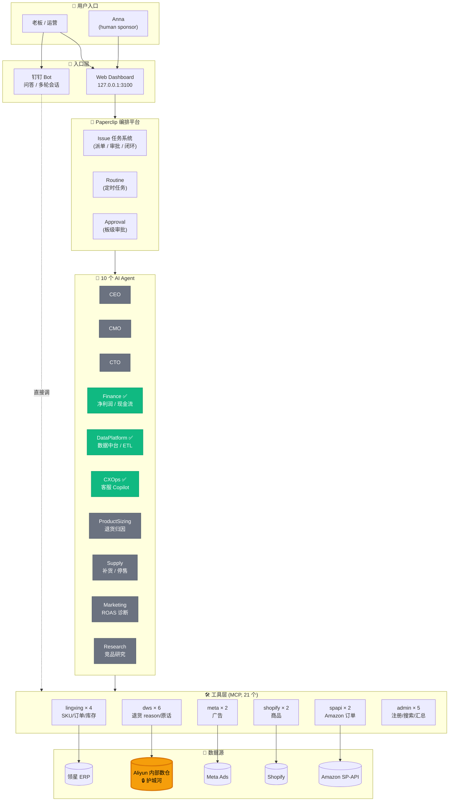

# Ever-Pretty AI 公司 —— 介绍

> **一句话**：把 Ever-Pretty（B2C `ever-pretty.com` + B2B `e4wholesale.com`）的销售、库存、退货、广告数据接进来，搭了一个**多 Agent 协作平台**，老板/运营在钉钉里直接问，背后自动调数据、跑分析、出可执行清单。

---

## 1. 它是什么

不是一个聊天机器人。是一家**虚拟公司**：10 个 AI 同事 + 一个数据中台 + 一个钉钉问答入口。

- **Anna 是真人 sponsor**（不是 AI），其余 10 个角色全是 Agent：CEO / CMO / CXOps / DataPlatform / Finance / Marketing / ProductSizing / Research / Supply / CTO
- 每个 Agent 有自己的职责说明、工具权限、预算上限
- 像内部跑任务系统一样派单（Issue），可以跨 Agent 协作、互审、汇报

---

## 1.5 架构一图看懂



**怎么看这张图**：
- **绿色 Agent** = 已经跑过真任务的（3 个）；灰色 = 架在那等业务派活的（7 个）
- **橙色 Aliyun 内部数仓** = 我们的护城河（Amazon 退货 reason code，外部 AI 拿不到）
- **两条用户路径**：日常问答走钉钉 → 直接调工具；深度任务走 Web → 派给 Agent → Agent 调工具

---

## 2. 现在能做什么

### A. 钉钉里直接问，秒级回答（已上线）

实测有效的问题：

| 问题 | 背后做的事 |
|---|---|
| "EP-US Top 10 SKU" | 销售排序 |
| "EP-US 库存预警" | 高速 SKU 缺货风险 |
| "EP-US 过去 30 天退货原因 Top 5" | reason 分布 + 客户原话引用 |
| "EP-US 偏小退货最多的 SKU 前 10" | 按 reason 过滤，给 Top SKU + 占比 |
| "EE02968 系列退货客户都说了什么" | 直接拿客户原话 |
| "EP-US 退货周环比" | 趋势对比 |

**亮点**：
- **退货分析三段式自动输出**：现状 / 主因 / 建议，一次回答串 3 个工具
- **客户原话作证**："Material thin / Chest is too tight" 直接引用
- **跨天会话连续**：昨天问的今天接着问，bot 记得上下文

### B. 深度运营任务（已交付清单）

| 任务 | 产出 |
|---|---|
| EP-US Top 100 SKU 退货模式诊断 | 4 月数据，分层报告 |
| EP-US 广告 ROAS 诊断 + 浪费 spend 识别 | 找出无效投放 |
| EP-DE 追投决策 / EU UK+DE 对比诊断 | 跨市场净对比 |
| SKU × Market 净利润分析 | 扣广告 + 退货 + 物流后的真实利润 |
| 现金流 30/60/90 天预测 | 配库存约束 |
| 客服 Copilot 知识库 | 8 款式 P0/P1 多语言话术 |
| **Anna Action Brief** | 给创始人的 2 页可执行清单 |
| Mermaid MG02468 上 Amazon 评估 | 启动期库存测算 + 跨渠道决策 |
| Cross-channel ROAS（Meta × Amazon） | 7 天 pilot |
| 竞品研究（Lulus / Hello Molly） | 自动 backfill |

### C. 当前正在跑（Dashboard 实况，刚才看的）

| Agent | 任务 | 状态 |
|---|---|---|
| Finance | CRO-44 重算 EP-US 净利润，纳入退货成本 + 广告浪费 | 运行中 |
| DataPlatform | CRO-45 修 bug + 探 ads schema + reviews 扩抓 | 运行中 |
| ProductSizing | CRO-42 EE41981 偏小退货归因 + 尺码表修订建议 | 刚交付 |
| Supply | CRO-41 EP-US 补货优先级 + 停售候选清单 | 待审 |
| Marketing | CRO-40 EP-US 广告 ROAS 诊断（最近 14 天） | 待审 |
| CXOps | CRO-43 EE41981 listing 一致性核查 | 待审 |

---

## 3. 数据接入（已打通）

| 数据源 | 内容 | 工具数 |
|---|---|---:|
| 领星 ERP | SKU / 订单 / 库存 / 缺货风险 | 4 |
| 内部数仓 (Aliyun DW) | Amazon 退货 reason code + 客户原话 + 趋势 | 6 |
| Meta Ads | 广告账户 / adset 表现 | 2 |
| Shopify | 商品 / 集合 | 2 |
| Amazon SP-API | 订单详情 | 2 |
| 系统内置 | 决策搜索 / 工具注册 / 成本汇总 | 5 |
| **合计** | | **21** |

**关键突破**：领星 API 不暴露 Amazon 退货 reason code，我们是**直连公司内部数仓**拿到的，这是 ChatGPT/通用 AI 拿不到的数据。

---

## 4. 系统现状（24×7 运行）

| 服务 | 用途 | 状态 |
|---|---|---|
| 钉钉 Bot | 用户问答入口 | launchd 守护 |
| Paperclip 平台 | Web UI + Agent 调度 | http://127.0.0.1:3100 |

完成度：

| 阶段 | 完成度 |
|---|---|
| Phase 0 基建（数据中台 / MCP / launchd） | **100%** |
| Phase 1 MVP 链路 | **95%** |
| Phase 2 多 Agent 横向复制 | 25%（10 个建好，3 个真在跑） |
| Phase 3 治理 + 闭环 | 5% |

---

## 5. 跟现有方案的区别

| 对比维度 | 通用 ChatGPT / 文心 | Ever-Pretty AI |
|---|---|---|
| 数据 | 拿不到内部 ERP / 退货原因 | 直连 21 个工具 |
| 上下文 | 单轮问答 | 跨天会话 + Issue 协作 |
| 角色 | 1 个助手 | 10 个 Agent，各自专业 |
| 产出 | 文字建议 | 可追踪的 Issue + 审批流 + 行动清单 |
| 隐私 | 数据出公网 | 本地部署，数据不出公司 |

---

## 6. 下一步要做什么（一周内）

**真去用一周（5/8 → 5/14）**：每天发 5–10 个真实运营问题给钉钉 bot，截图记录答歪 / 答得意外好 / 想问但没工具 / 嫌延迟，一周后对照 38 项 backlog 决定真该动哪几个。

**已识别的扩展候选**：
- bot ↔ paperclip 双向联动（在钉钉里直接派任务给 Agent）
- 滞销库存 / Reviews 检索 / 退货率排行 / 跨店对比 / Amazon PPC / BSR 监控 / FBA 仓储费 等 13 个工具空白
- 凯帝丽莎 B2B 数据接入
- 周报自动推送（被动 → 主动）

---

## 7. 风险与坦白

- **退货原因 51% 是 `other`**（Amazon 默认）—— 需要跟数仓团队确认分类映射
- **Reviews 表只有 84 行**（5/6 才开始抓）—— Reviews 分析要先扩量
- **大部分 Agent（7/10）还没真跑过**，等业务派活才会激活
- **bot 后端用了 tabcode 网关**，存在锁定风险，未来要切回 Claude API

---

## 8. 完善路线图（如果再投入）

按"对老板可见的能力提升"排序，不按技术分类列。

### 8.1 能力空白：用户想问但答不上（运营天天用）

| 缺失工具 | 老板/运营会问 | 工时 | 数据 |
|---|---|---|---|
| 滞销库存 / 库龄分析 | "超过 60 天没动销的 SKU 有哪些" | 1h | ✅ 领星已有 |
| 真退货率 Top（百分比） | "退货率最高的 10 款是哪些" | 1.5h | ✅ 但要 join |
| 跨店横评 | "EP-US vs EP-UK 全店 GMV 对比" | 1h | ✅ 领星已有 |
| Amazon Reviews 检索 | "EE02968 评论里说尺码偏小的多吗" | 1h | ✅ 表已抓需扩量 |
| 每日销售曲线 | "5 月每天 GMV 长什么样" | 1h | ✅ 领星已有 |
| Amazon PPC / SP / SB / SD | "Amazon 自家广告 ROAS 怎么样" | 半天～1天 | ❓ 可能没接 |
| BSR 排名变化 | "EE02968 上个月 BSR 走势" | 1-2h | ✅ 已有表 |
| FBA 仓储费 / 长期仓储费 | "哪些 SKU 长期仓储费在烧钱" | 半天 | ❓ 需 SP-API |
| 按 style 聚合（跨色跨码合并） | "EP-US Top 10 款式，不是 SKU" | 1h | ✅ 已有字段 |
| 新品表现 Top | "上月新发的 SKU 谁卖得好" | 1h | ✅ first_seen |

合计 **13 项**，**5～8 个工作日** 从 21 工具扩到 34 工具。

### 8.2 Agent 空白：架在那没真跑过的（7/10）

现在真在用：Finance / DataPlatform / CXOps。剩下 7 个：

| Agent | 想让它干什么 | 触发 |
|---|---|---|
| CEO | 月度战略复盘 / 跨 Agent 协调 / 给 Anna 写决策 brief | 业务派任务 |
| CMO | 营销方向 / 内容日历 / KOL 直播策略 | 业务派任务 |
| Marketing | 广告 ROAS 周诊断（自动跑） | 配 Routine |
| Supply | 补货 / 停售 / 季节性备货 | 配 Routine |
| Research | 持续竞品监控（Lulus / Hello Molly / Dia） | 配 Routine |
| ProductSizing | 退货归因专家（吃 dws.* 工具） | 更新 AGENTS.md，1h |
| CTO | 技术债 / 架构演进 / 系统监控 | 内部用 |

**洞察**：5 个 Agent 只要配**定时 Routine**，从"架子"变"真同事"。

### 8.3 链路空白：被动 → 主动 + 闭环

| 升级 | 价值 | 工时 |
|---|---|---|
| **定时周报** | Marketing 周一推 ROAS / Supply 推补货 / Finance 月推净利润 | 半天/个 |
| **闭环建议追踪** | 建议被采纳后→自动追踪指标变化（"上周建议改 EE41981 尺码表，本周退货率 18% → 12%"） | 1-2 天 |
| **bot ↔ paperclip 联动** | 钉钉里说"派给 ProductSizing 跟进 EE02968"→自动建 issue→Agent 跑完推回钉钉 | 半天～4 天 |

**最戏剧化的演示**：闭环追踪。老板看到"建议→执行→效果"，AI 不是回答问题，是**真在改善业务**。

### 8.4 数据空白：另一条腿和盲区

| 空白 | 影响 | 工时 |
|---|---|---|
| **凯帝丽莎 B2B 数据接入** | 公司另一条腿，目前 0 信号——B2B 老板看不到任何 AI 输出 | 数天 |
| Reviews 数据扩量（84 行 → 几万行） | Phase 2 评论分析 Agent 现在跑不动 | 1-2 天 |
| 跨渠道退货（Shopify / TikTok / Dia & Co） | 现在只覆盖 Amazon，DTC + B2B 全黑洞 | 1-2 天 |
| SP-API FBA Customer Returns Report 直拉 | 拿到 buyer-seller messages 等领星不暴露字段 | 3-5 天 |

### 8.5 架构债：迟早要还

| 债 | 不还会怎样 | 还的成本 |
|---|---|---|
| bot 是平行 mini agent 平台（不是 paperclip Concierge） | 双系统认知成本，prompt 改动要重启，记忆不互通 | 3-4 天 |
| tabcode 网关锁定（无 prompt cache、可能改价 / 变接口） | 长期成本不可控 | 1h 切 Claude API |
| 上游同步 ahead 23 / behind 63 还在涨 | 越拖越痛 | 半天～2 天 |

### 8.6 优先级矩阵

```
价值 ↑
高 │ 闭环追踪 ★      凯帝丽莎接入 ★
   │ 定时周报 ★      Reviews 扩量
   │
中 │ 13 工具补全     bot↔paperclip 联动     7 Agent 激活
   │ Amazon PPC
   │
低 │ Tool catalog 缓存  日志统一面板        架构债（Concierge 迁移）
   │ Response cache
   └──────────────────────────────────────────→
       低（小时级）       中（天级）           高（周级）       工时
```

**★ = 老板能立刻看见效果的**

### 8.7 推荐：如果只能挑 3 件

1. **5 个 Agent 配 Routine 自动跑**（半天）→ Dashboard 立刻从 3/10 变 8/10 在跑，戏剧效果拉满
2. **闭环追踪**（1-2 天）→ "AI 不只是回答，而是改善业务"，最强演示话术
3. **凯帝丽莎 B2B 接入**（数天）→ 把另一条腿盘活，老板才会觉得"这是公司级 AI 不是部门工具"

---

## 演示路径建议（给老板看 5 分钟）

1. **打开钉钉**，问 "EP-US 偏小退货最多的 SKU 前 10" → 看 30 秒内出三段式答案
2. **打开 Dashboard**（http://127.0.0.1:3100/CRO/dashboard）→ 看 Agent 实时跑任务
3. **点开 CRO-44 Finance Phase 2** → 看 Agent 自己写的工作日志、调用了哪些工具、给出什么结论
4. **强调一句**："这套数据 ChatGPT 拿不到，是我们公司自己的护城河。"
